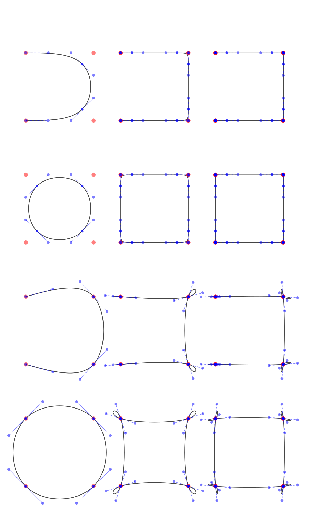

## Non-rational Bezier curves and splines (composite Bezier curves)

This package exists mostly to create C2-continuous, non-rational cubic Bezier splines. In other words, this will approximate or interpolate a sequence of points into a sequence of non-rational cubic Bezier curves.

Should be relatively fast, but this isn't suited for heavy math. This is for taking some points you have and making a nice-looking curve out of them. Specifically, a cubic Bezier spline, which is made from the type of curves used in SVG, fonts, and other vector-base programs. I am only interested in feature requests that directly apply to that purpose. This is not an exercise in completism.

### install

    pip install cubic_bezier_spline

### this package will

* Evaluate, differentiate, elevate, and split non-rational Bezier curves of any degree
* Construct non-rational cubic Bezier splines (open and closed, approximating and interpolating)
* Evaluate and differentiate non-rational Bezier splines of any degree

### this package will not**

* Work with rational Bezier splines, b-splines, NURBS, or any other generalization of Bezier curves
* Decrease curve degree
* Approximate curve intersections
* Approximate the length of a curve
* "Stroke" (move left or right) a curve 

** much of the "will not" features can be found here: https://github.com/dhermes/bezier

### Public classes / functions

    # a c2-continuous cubic Bezier spline near the control points
    new_open_approximating_spline([(x0, y0), (x1, y1), ...])

    # a c2-continuous cubic Bezier spline near the control points
    new_closed_approximating_spline([(x0, y0), (x1, y1), ...])

    # a c2-continuous cubic Bezier spline through the control points
    new_open_interpolating_spline([(x0, y0), (x1, y1), ...])

    # a c2-continuous cubic Bezier spline through the control points
    new_closed_interpolating_spline([(x0, y0), (x1, y1), ...])

Any of these will return a BezierSpline object. This object has a some of the usual methods (e.g., elevate, derivative, split) to help find path normals or do some light modeling, but you may be most interested in.

    # plot the spline at a given point, where time is 0 to
    # (number of input points + 1)
    spline(time: float)

    # an svg data string
    # (the d="" attribute of an SVG path object)
    spline.svg_data

### Examples

Some of these use double and triple repeated points to create "knots". This isn't a special function, just a feature of Bezier math. The idea is clearer with a picture.

<picture>
  <source media="(prefers-color-scheme: dark)" srcset="doc/test_knot_dark.png">
  <source media="(prefers-color-scheme: light)" srcset="doc/test_knot_light.png">
  
</picture>

### Most of the math can be found in:

* A Primer on Bezier Curves 
https://pomax.github.io/bezierinfo/
* UCLS-Math-149-Mathematics-of-Computer-Graphics-lecture-notes 
https://www.stkent.com/assets/pdfs/UCLA-Math-149-Mathematics-of-Computer-Graphics-lecture-notes.pdf
